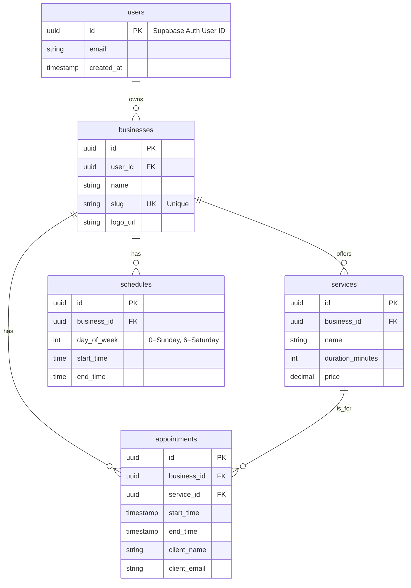

### **Especificaciones de Arquitectura (Architecture Specs) - easyTurn MVP**

#### **1. System Architecture**

El sistema está diseñado como una aplicación web monolítica full-stack utilizando Next.js, alojada en Vercel y respaldada por Supabase como nuestro Backend-as-a-Service (BaaS). Esta arquitectura prioriza la velocidad de desarrollo (DX), el rendimiento y la escalabilidad desde el inicio.

```mermaid
graph TD
    subgraph "Client Browser"
        A[User (Business Owner / End Client)]
    end

    subgraph "Vercel Platform"
        B[Frontend (Next.js / React Server Components)]
        C[Backend (Next.js API Routes)]
    end

    subgraph "Supabase (BaaS)"
        D[Database (PostgreSQL)]
        E[Authentication]
        F[Storage (for logos)]
    end

    G[Transactional Emails (Supabase/SMTP)]

    A -- Interacts via HTTPS --> B
    B -- Fetches data / Invokes actions --> C
    C -- Authenticates with --> E
    C -- Reads/Writes data --> D
    C -- Manages files --> F
    C -- Triggers emails --> G
```

**Flujo del Diagrama:**
1.  El **Usuario** interactúa con el **Frontend** (una PWA construida con Next.js y React Server Components).
2.  El **Frontend** se comunica con el **Backend** (Next.js API Routes) para cualquier lógica de negocio.
3.  El **Backend** utiliza el SDK de Supabase para interactuar con los servicios de **Autenticación**, **Base de Datos** y **Almacenamiento**.
4.  Las notificaciones por email se gestionan a través del servicio de **Emails Transaccionales** de Supabase.

---

#### **2. Database Design (Entity-Relationship Diagram)**

El diseño de la base de datos se centra en las entidades principales del negocio.


**Nota Importante:** Este ERD es una representación conceptual. No se generarán esquemas SQL estáticos en este documento. El esquema real y las migraciones se gestionarán directamente en la plataforma de Supabase, y se podrá obtener una representación en tiempo real utilizando las herramientas de la CLI de Supabase.

---

#### **3. Tech Stack Justification**

| Componente | Justificación |
| :--- | :--- |
| **Frontend & Backend: Next.js 15 (App Router)** | ✅ **Rendimiento Superior:** El uso de React Server Components (RSC) reduce el JavaScript enviado al cliente. <br> ✅ **DX Unificada:** El routing basado en ficheros y la capacidad de tener componentes de servidor y cliente en la misma estructura simplifica el desarrollo. <br> ✅ **Framework Full-stack:** Las API Routes integradas permiten construir un backend robusto sin necesidad de un servidor separado. <br> ❌ **Trade-off:** La curva de aprendizaje del App Router y los RSC es más pronunciada que la del Pages Router tradicional. |
| **BaaS: Supabase** | ✅ **Solución Todo-en-Uno:** Provee base de datos (Postgres), autenticación, storage y serverless functions en una única plataforma, acelerando el desarrollo. <br> ✅ **Seguridad Integrada:** Row Level Security (RLS) de Postgres permite implementar una lógica de autorización potente y segura a nivel de base de datos. <br> ✅ **Excelente DX:** El SDK de cliente es muy intuitivo y se integra perfectamente con Next.js. <br> ❌ **Trade-off:** Cierta dependencia del proveedor (vendor lock-in). Menos control granular que una solución auto-alojada. |
| **Hosting: Vercel** | ✅ **Integración Perfecta:** Diseñado por los creadores de Next.js, ofrece la mejor experiencia de despliegue y rendimiento para este framework. <br> ✅ **Red Global (Edge):** Despliegue automático en una CDN global para una latencia mínima en cualquier parte del mundo. <br> ✅ **CI/CD Automático:** Despliegues instantáneos con cada `git push` a la rama principal y generación de previews por cada Pull Request. <br> ❌ **Trade-off:** Puede ser más costoso a gran escala en comparación con soluciones IaaS como AWS EC2. |
| **Validación: Zod** | ✅ **Seguridad de Tipos:** Permite definir un único esquema de validación y derivar los tipos de TypeScript, eliminando la duplicación de código. <br> ✅ **Isomórfico:** Funciona tanto en el servidor (Node.js) como en el cliente (navegador). <br> ✅ **DX Declarativa:** La creación de esquemas es simple y legible. <br> ❌ **Trade-off:** Añade una pequeña dependencia al bundle del cliente. |

---

#### **4. Data Flow Example: New Appointment Booking**

1.  **Client (Browser):** El usuario `Ana` selecciona un servicio, fecha y hora en el frontend de Next.js.
2.  **Client (Browser):** Rellena su nombre y email. El formulario realiza una validación inicial con **Zod**.
3.  **HTTP Request:** El cliente envía una petición `POST` a `/api/appointments` con los datos de la reserva.
4.  **Backend (API Route):** La API Route recibe la petición.
5.  **Server-side Validation:** Valida de nuevo el cuerpo de la petición usando el mismo esquema de **Zod**.
6.  **Business Logic (Concurrency Check):** El backend realiza una consulta a **Supabase** para verificar que el slot de tiempo no ha sido ocupado mientras Ana completaba el formulario (race condition).
7.  **Database Write:** Si el slot está libre, el backend ejecuta una inserción en la tabla `appointments` a través del cliente de **Supabase**.
8.  **Async Task:** El backend (o un trigger de DB) invoca una función para enviar los emails de confirmación al cliente y al dueño del negocio.
9.  **HTTP Response:** El backend retorna una respuesta `201-Created` con los datos de la cita creada.
10. **Client (Browser):** El frontend recibe la respuesta, muestra un mensaje de éxito y limpia el formulario.

---

#### **5. Security Architecture**

-   **Authentication Flow Diagram (Login):**

    ```mermaid
    sequenceDiagram
        participant User
        participant Frontend
        participant Backend
        participant SupabaseAuth

        User->>Frontend: Ingresa email y contraseña
        Frontend->>Backend: POST /api/auth/login con credenciales
        Backend->>SupabaseAuth: Llama a signInWithPassword(credentials)
        SupabaseAuth-->>Backend: Retorna { data: { session }, error }
        alt Sesión Válida
            Backend-->>Frontend: Retorna la sesión y establece una cookie HTTP-Only segura
            Frontend-->>User: Redirige al Dashboard
        else Error de Autenticación
            Backend-->>Frontend: Retorna error 401 Unauthorized
            Frontend-->>User: Muestra mensaje "Email o contraseña incorrectos"
        end
    ```

-   **RBAC (Role-Based Access Control) Implementation:**
    La autorización se implementará principalmente a través de **Row Level Security (RLS) en Supabase**. Esto asegura que un usuario solo pueda acceder o modificar los datos que le pertenecen.
    *   **Ejemplo de Política RLS (en pseudo-SQL):**
        ```sql
        -- Los dueños de negocios solo pueden leer las citas de su propio negocio.
        CREATE POLICY "Allow business owners to read their own appointments"
        ON appointments FOR SELECT
        USING (
          auth.uid() = (SELECT user_id FROM businesses WHERE id = appointments.business_id)
        );
        ```

-   **Data Protection:**
    *   **In-Transit:** Forzado por Vercel a través de HTTPS/TLS 1.3.
    *   **At-Rest:** Cifrado automático de la base de datos y el storage por parte de Supabase.
    *   **Input Sanitization:** Se realizará una validación estricta de todos los datos de entrada en el backend con Zod para prevenir ataques de inyección.
